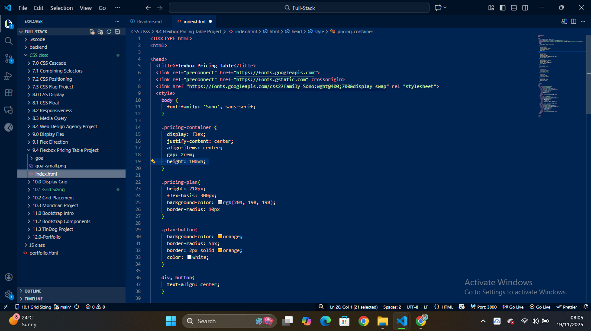
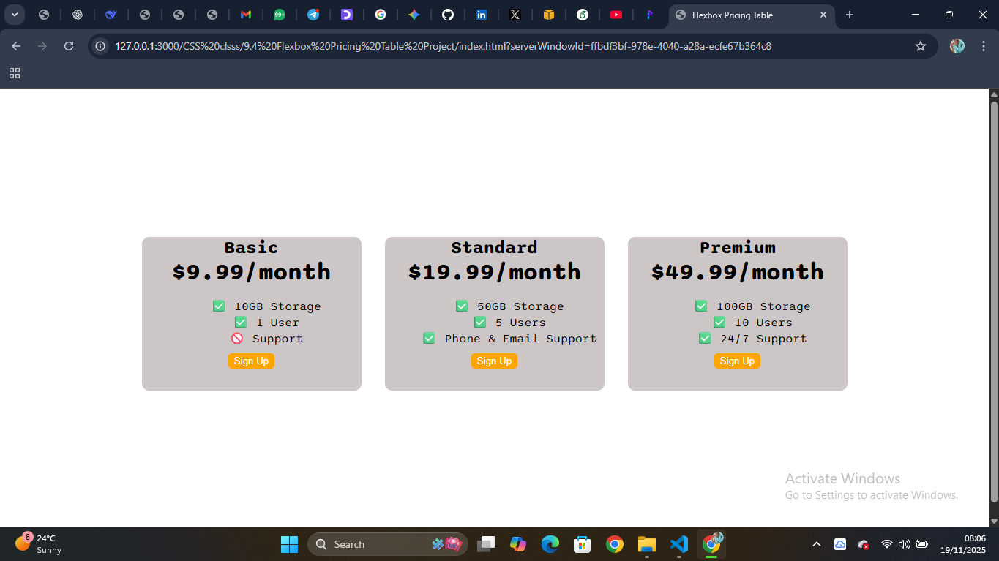

# 🎨 Flexbox Pricing Table

A simple and clean pricing table built with **HTML + CSS Flexbox**.  
This project demonstrates responsive layout techniques and Flexbox alignment.

---

## 🚀 Features

- Clean and modern UI
- Fully built with HTML & CSS
- Uses Flexbox for alignment
- Three pricing tiers
- Beginner-friendly project structure

---

## 🖼️ Screenshots

### 🔹 Project Structure (VS Code)

This shows the complete folder structure and HTML/CSS setup.  


### 🔹 Final UI (Browser View)

Complete 3-column pricing table showing Basic, Standard, and Premium plans.  


---

## 🛠️ Tech Used

- HTML5
- CSS3 (Flexbox)
- Google Fonts (Sono)

---

## 📦 How to Run

```bash
git clone https://github.com/YOUR-USERNAME/your-repo.git
cd your-repo
Open index.html in your browser
```
